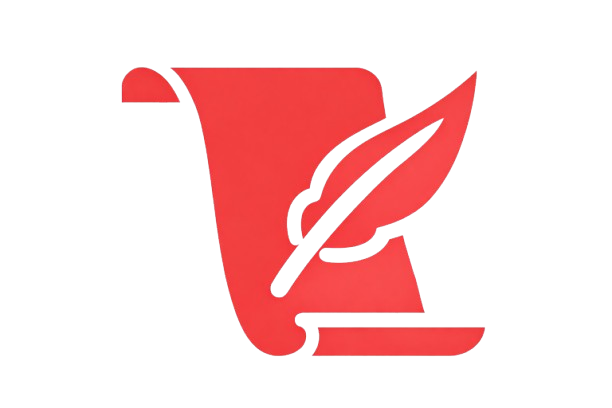
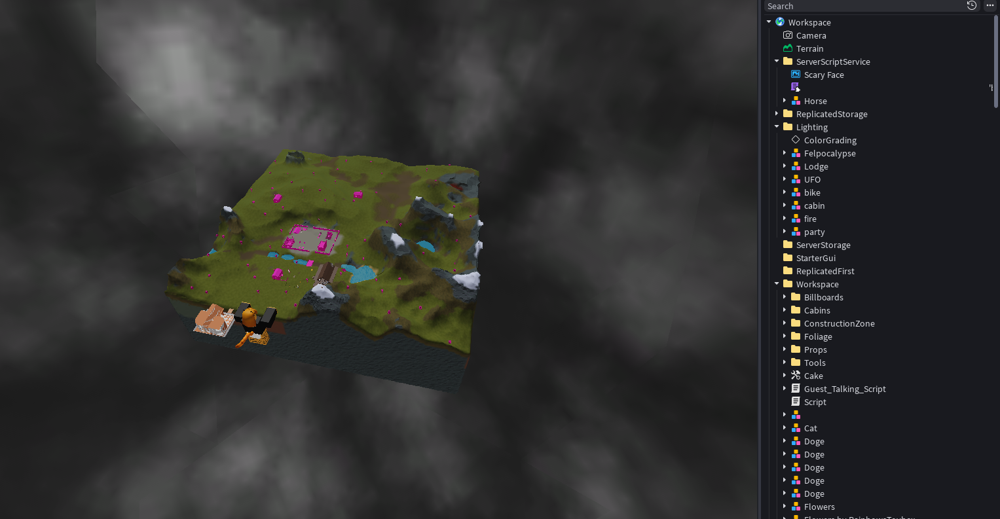

# RTX

The Roblox Decompiler Suite Since 2017

RTX is A revolutionary suite built with precision beyond other decompilers. Developed for reconstructing, it operates through advanced memory editing to recover, rebuild, and restore scripts that were never meant to be seen again.

Every layer is calculated. Every function is traced as Complex logic paths are brought back into structure with clean results, and it attempts to auto clean the scripts so you get a clean output to use,

RTX will even attempt to retrieve the variables of a script via what is loaded upon joining the game using a revolutionary method.

RTX analyzes runtime behavior, mapping execution flow as it happens and reconstructing hidden dependencies that typical compilers ignore. This allows it to rebuild scripts in a structured format that reflects their original chain with higher readability.

```
Release Soon
```



RTX filters out redundant or corrupted instruction paths while preserving core funcs. The result is a reconstruction that is closer to the original intent of the script rather than a fragmented dump of raw data which Decompilers like Konstant could NEVER do!

Its processing engine is decently fast and depth simultaneously, allowing it to handle complex anti cheats without sacrificing accuracy. Whether dealing with layered modules obfuscated structures or dynamically generated code, RTX promises to never crash (even if you have a low level executor) throughout the entire reconstruction cycle.

RTX represents a shift in how script recovery is approached, Let's see any other decompiler do that in a million years!

**Think again before competing with RTX**
